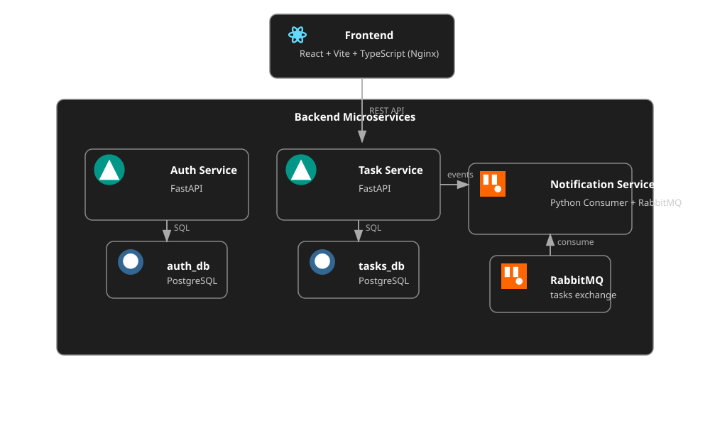

# Smart Task Manager — React + FastAPI Microservices (Docker, RabbitMQ, PostgreSQL)

<p align="center">
  <a href="README.md"></a>
  <a href="README.ua.md"></a>
</p>

Ein modernes, übersichtliches und intuitives Aufgabenverwaltungssystem mit Authentifizierung, Filterfunktionen, anpassbaren UI‑Themes und vollständig containerisierter Microservices‑Architektur.

---

## 💼 Für Recruiter

Dieses Projekt ist ein **Demo‑Mini‑Produkt**, das meinen technischen Ansatz und mein Architekturverständnis zeigt.  
Es demonstriert:

- Microservices‑Architektur (FastAPI + RabbitMQ + PostgreSQL)  
- Saubere Service‑Trennung und skalierbares Design  
- Produktionsreife Docker‑Orchestrierung  
- CI, Healthchecks, Umgebungs‑Konfiguration  
- Hohe Testabdeckung (~91%)  
- Fokus auf UI/UX: Themes, Responsiveness, klare Interfaces  

Ich bin offen für Möglichkeiten, in einem Team an spannenden, technisch anspruchsvollen Projekten mitzuwirken.

---

## 📱 UI Vorschau

<div align="center">

| Mobile | Registrierung | Login |
|--------|---------------|-------|
|  |  |  |

| Eye Theme | Neumorphismus | Aufgabe bearbeiten |
|-----------|---------------|--------------------|
|  |  |  |

| Erledigt | Aktiv | Alle Aufgaben |
|----------|-------|---------------|
|  |  |  |

</div>

---

## 🏗️ Architekturdiagramm

<p align="center">
  
</p>

---

## 🚀 Tech Stack

### **Frontend**
- React + Vite + TypeScript  
- TailwindCSS  
- Context API  
- REST API Integration  
- Nginx (Production)

### **Backend**
- FastAPI (Auth, Tasks)  
- PostgreSQL (separate DB pro Service)  
- SQLAlchemy  
- RabbitMQ  
- Python Consumer  
- Docker Compose  
- Healthchecks  

---

## 🎨 Funktionen

### **Aufgaben**
- Erstellen, Bearbeiten, Löschen  
- Filter: Alle / Aktiv / Erledigt  
- Responsives UI  

### **Themes**
- Minimal  
- Neumorphismus  
- Glassmorphismus  
- Persistente Theme‑Speicherung  
- Einstellungsmenü  

### **Auth**
- Registrierung / Login  
- JWT Tokens  
- Geschützte Routen  

### **Architektur**
- Microservices  
- Unabhängige Datenbanken  
- RabbitMQ Events  
- Nginx SPA  
- Vollständige Docker‑Orchestrierung  

---

## 📁 Projektstruktur

```
smart-task-manager/
├── services/
│   ├── auth-service/
│   ├── task-service/
│   └── notification-service/
│
├── frontend/
│   ├── public/
│   ├── src/
│   ├── nginx.conf
│   ├── package.json
│   ├── vitest.config.ts
│   └── vite.config.ts
│
├── docker-compose.yml
├── Makefile
└── README.de.md
```

---

## 🐳 Projekt starten (Docker)

### **1. `.env` Datei erstellen**

```env
AUTH_DB_USER=postgres
AUTH_DB_PASSWORD=postgres
AUTH_DB_NAME=auth_db

TASK_DB_USER=postgres
TASK_DB_PASSWORD=postgres
TASK_DB_NAME=tasks_db

RABBITMQ_USER=guest
RABBITMQ_PASSWORD=guest

VITE_AUTH_API_URL=http://auth-service:8001
VITE_TASK_API_URL=http://task-service:8002
```

### **2. Alle Services starten**

```bash
make up
```

Die Anwendung ist erreichbar unter:

```
http://localhost:5173
```

### **3. Nützliche Befehle**

```bash
make up
make down
make logs
make ps
make restart
```

---

## 🩺 Healthchecks

| Service               | Check                                      |
|----------------------|---------------------------------------------|
| auth-service         | `GET /health`                               |
| task-service         | `GET /health`                               |
| notification-service | RabbitMQ Management API                     |
| rabbitmq             | `rabbitmq-diagnostics ping`                 |
| frontend             | `curl http://localhost`                     |

---

## 🧪 API Dokumentation

- **Auth Service** → http://localhost:8001/docs  
- **Task Service** → http://localhost:8002/docs  

---

## 🧪 Tests

### Frontend (Vitest + RTL)
- Auth Flows  
- Task CRUD  
- Filter  
- Einstellungen  
- Lade‑ und Fehlerzustände  

### Backend (pytest)
- Auth Routen  
- JWT Logik  
- Task CRUD  
- RabbitMQ Consumer  
- Abdeckung: **~91%**

---

## 🤝 Kontakt

**GitHub:** https://github.com/Olhafaruk  
**Email:** farukolga2017@gmail.com
```
