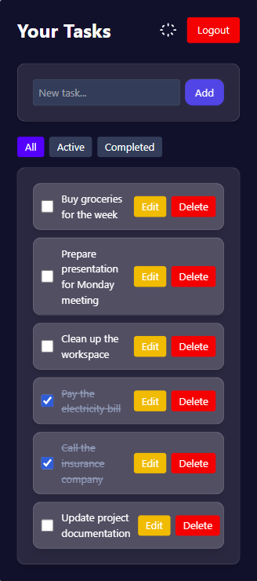
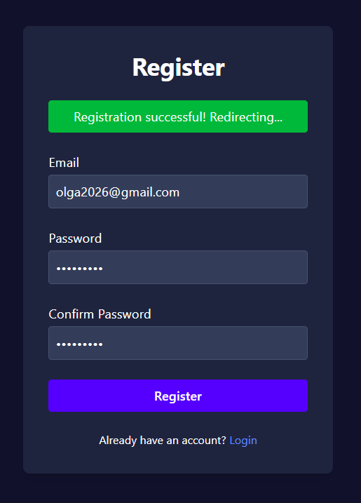
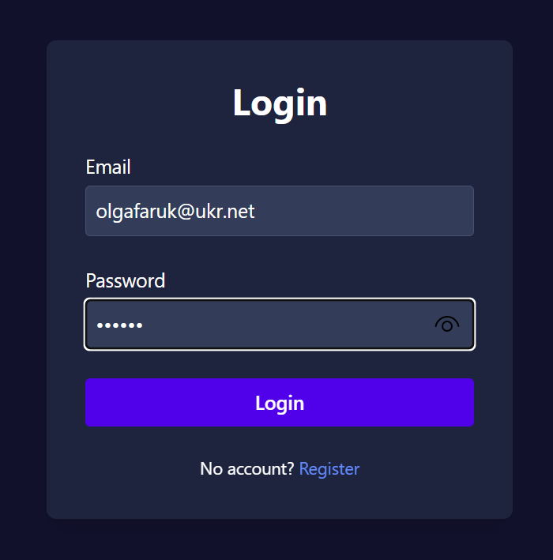
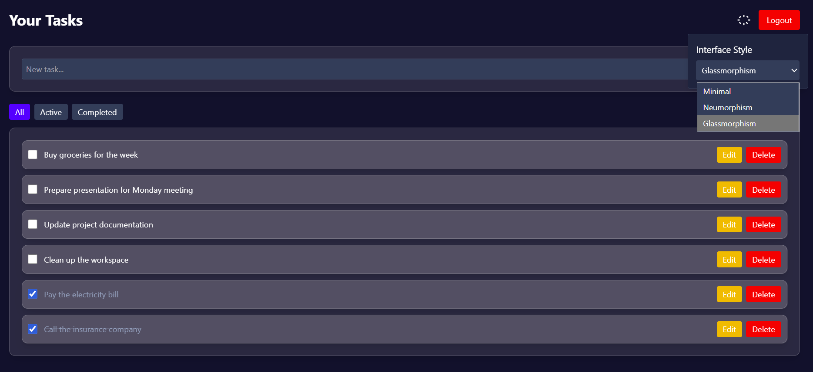
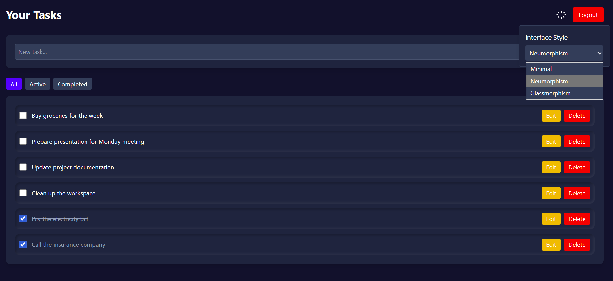
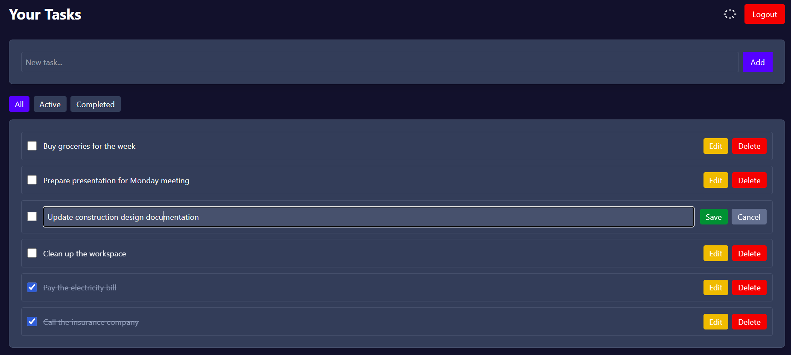
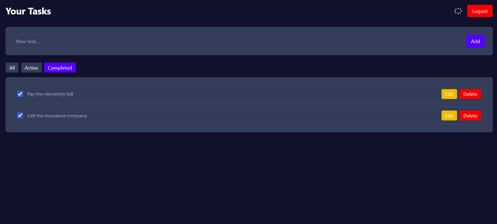
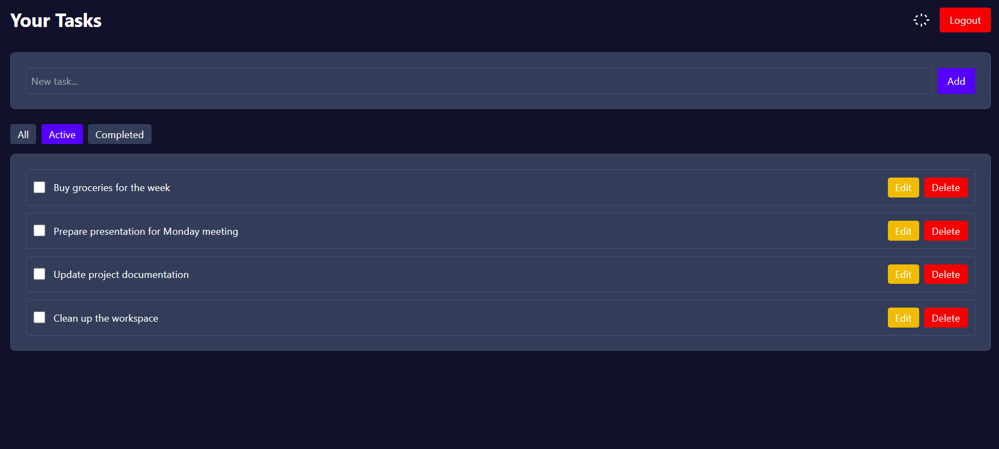
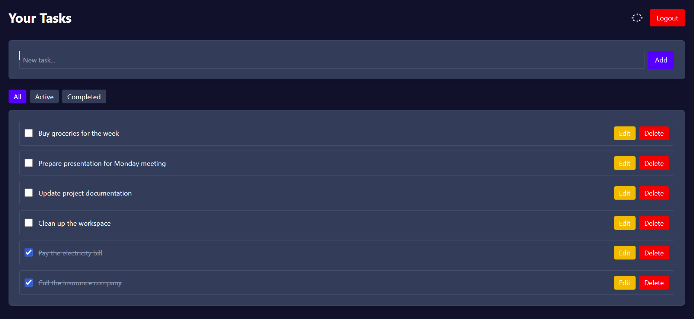

# Smart Task Manager — React + FastAPI Microservices (Docker, RabbitMQ, PostgreSQL)

<p align="left">
  
  
  
  
  
  
</p>

A modern, clean, and intuitive task management application with authentication, task filters, customizable UI themes, and a fully containerized microservices architecture.

---

## 📱 UI Preview

<div align="center">

| Mobile | Register | Login |
|--------|----------|-------|
|  |  |  |

| Eye Theme | Neumorphism | Edit Task |
|-----------|-------------|-----------|
|  |  |  |

| Completed | Active | All Tasks |
|-----------|--------|-----------|
|  |  |  |

</div>

---

## 🏗️ Architecture Diagram

```
                     ┌──────────────────────┐
                     │      Frontend        │
                     │  React + Vite + TS   │
                     │      (Nginx)         │
                     └──────────┬───────────┘
                                │ REST
                                ▼
        ┌──────────────────────────────────────────────────────┐
        │                      Backend                          │
        │                                                      │
        │  ┌──────────────────┐     ┌──────────────────┐      │
        │  │  Auth Service    │     │  Task Service     │      │
        │  │   FastAPI        │     │    FastAPI        │      │
        │  └───────┬──────────┘     └─────────┬────────┘      │
        │           │ PostgreSQL               │ PostgreSQL     │
        │           ▼                          ▼                │
        │     auth_db                     tasks_db              │
        │                                                      │
        │  ┌────────────────────────────────────────────────┐  │
        │  │             Notification Service                │  │
        │  │       Python Consumer + RabbitMQ                │  │
        │  └────────────────────────────────────────────────┘  │
        └──────────────────────────────────────────────────────┘
```

---

## 🚀 Tech Stack

### **Frontend**
- React + Vite + TypeScript  
- TailwindCSS  
- Context API (global theme management)  
- REST API integration  
- Nginx (production build)

### **Backend**
- FastAPI (Auth Service, Task Service)  
- PostgreSQL (separate DB per service)  
- SQLAlchemy  
- RabbitMQ (message broker)  
- Python Consumer (Notification Service)  
- Docker & Docker Compose  
- Healthchecks for all services  

---

## 🎨 Features

### **Tasks**
- Create, edit, delete tasks  
- Filters: **All / Active / Completed**  
- Clean, responsive UI  

### **Themes**
- Minimal  
- Neumorphism  
- Glassmorphism  
- Persistent theme storage  
- Settings panel (⚙️)

### **Auth**
- Register / Login  
- JWT tokens  
- Protected routes via `PrivateRoute`  

### **Architecture**
- Microservices  
- Independent databases  
- RabbitMQ notifications  
- Nginx‑served SPA frontend  
- Full Docker orchestration  

---

## 📁 Project Structure

```
smart-task-manager/
├── services/                     # Backend microservices
│   ├── auth-service/
│   │   └── src/
│   ├── task-service/
│   │   └── src/
│   └── notification-service/
│       └── src/
│
├── frontend/                     # React + Vite + Nginx
│   ├── public/
│   ├── src/
│   │   ├── assets/
│   │   ├── components/
│   │   ├── context/
│   │   └── pages/
│   ├── nginx.conf
│   ├── package.json
│   └── vite.config.ts
│
├── docker-compose.yml
├── Makefile
├── .dockerignore
├── .gitignore
└── README.md
```

---

## 🐳 Running the Project (Docker)

### **1. Create `.env` in the project root**

```env
AUTH_DB_USER=postgres
AUTH_DB_PASSWORD=postgres
AUTH_DB_NAME=auth_db

TASK_DB_USER=postgres
TASK_DB_PASSWORD=postgres
TASK_DB_NAME=tasks_db

RABBITMQ_USER=guest
RABBITMQ_PASSWORD=guest

VITE_AUTH_API_URL=http://auth-service:8001
VITE_TASK_API_URL=http://task-service:8002
```

### **2. Start all services**

```bash
make up
```

Application will be available at:

```
http://localhost:5173
```

### **3. Useful commands**

```bash
make up        # start all services
make down      # stop all services
make logs      # view logs
make ps        # container status
make restart   # rebuild + restart
```

---

## 🩺 Healthchecks

| Service               | Check                                      |
|----------------------|---------------------------------------------|
| auth-service         | `GET /health`                               |
| task-service         | `GET /health`                               |
| notification-service | RabbitMQ management API                     |
| rabbitmq             | `rabbitmq-diagnostics ping`                 |
| frontend             | `curl http://localhost` (Nginx)             |

---

## 🧪 API Documentation

- **Auth Service** → http://localhost:8001/docs  
- **Task Service** → http://localhost:8002/docs  

Swagger UI is enabled for both.

---

## 🗺️ Roadmap

### ✅ Completed
- Full microservices architecture (Auth, Tasks, Notifications)
- Dockerized environment with healthchecks
- Responsive UI with multiple themes
- JWT authentication
- Task filters and inline editing
- Nginx production build

### 🚧 In Progress
- ESLint + Prettier + Husky
- GitHub Actions CI pipeline
- Unit tests (Jest + RTL)
- Integration tests for services
- Architecture refactor (API layer, hooks, utils)

### 🔮 Planned
- E2E tests (Playwright)
- Dark mode improvements
- User profile page
- Multi‑language support
- Deploy to Render / Railway

---

## 🤝 Contact

**GitHub:** https://github.com/Olhafaruk  
**Email:** farukolga2017@gmail.com
```
